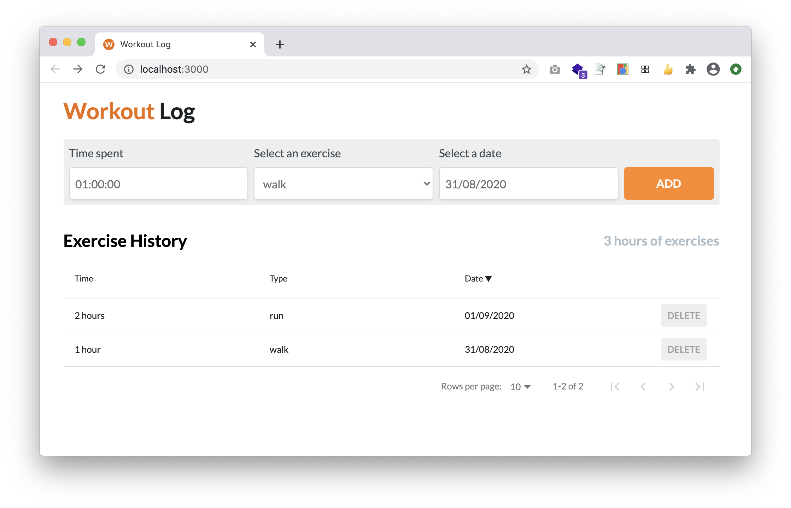

# Workout Log App

Que tal manter o seu histórico de exercícios em sua própria aplicação? Que tal deixar de compartilhar seus dados físicos com terceiros ou ter de ler uma miríade de páginas com "Os nossos termos"? O Workout Log App permite que você guarde o seu histórico de exercícios de forma simples e direta a partir do seu navegador, sem precisar realizar downloads.

Merchan a parte, este repositório tem o intuito de demonstrar habilidades de front-end na construção de aplicações modernas. A aplicação foi construída utilizando tecnologias como React, Redux, HTML5, CSS3 e SASS.



Acesse a demonstração em https://joffilyfe.github.io/workoutlog.

## Sumário
- [1 - Instalando a aplicação em modo desenvolvimento](#1---instalando-a-aplicação-em-modo-desenvolvimento)
    - [1.1 - Dependências](#11---dependências)
    - [1.2 - Instalação](#12-instalação)
- [2 - Execução](#2---execução)
- [3 - Executando os testes](#3---executando-os-testes)
- [4 - Build e Deploy](#4---build-e-deploy)
- [5 - Documentação](5---documentação)

## 1 - Instalando a aplicação em modo desenvolvimento

Para instalar a aplicação é necessário seguir os passos descritos nos tópicos _Dependências_ e _Instalação_.

### 1.1 - Dependências

Antes de instalar a aplicação, certifique-se de que tenha os seguintes softwares em seu ambiente de desenvolvimento:

- nodejs >= `v10.15.3`
- npm >= `6.13.1`
- git (Apenas em modo de desenvolvimento)

Para download do nodejs acesse https://nodejs.org/en/download/ ou utilize o seu gerenciador de aplicações favorito. Dê preferências para versões LTS.

### 1.2 Instalação

Para instalar a aplicação rode os dois comandos demonstrados a seguir:

```shell
$ git clone https://github.com/joffilyfe/workoutlog.git
$ cd workoutlog
$ npm install
```

Simples, não é mesmo? A partir deste ponto você deve ter todas as suas dependências de produção e desenvolvimento no seu computador. Basta então executarmos a aplicação.

### 2 - Execução

Para iniciar a aplicação execute o código:

```shell
$ npm start
```

Abra um navegador de sua preferência e acesse o endereço http://localhost:3000.

### 3 - Executando os testes

A aplicação possui alguns casos de teste para garantir a cobertura do seu funcionamento básico, para verificar o status dos testes, execute:

```shell
$ npm run test
```

### 4 - Build e Deploy

Este repositório não contém scripts para deploy automático da aplicação, sendo assim, será necessário executar o `build` da aplicação e distribuí-la em algum site capaz de servir arquivos estáticos.

Para realizar o build, execute:

```shell
$ npm run build
```

Ao término desta execução, o diretório `build` deve ter o conteúdo que deve ser enviado para o seu servidor de arquivos estáticos favorito. Algumas recomendações pessoais são: Amazon S3 e o próprio Github Pages.

### 5 - Documentação

Para mais detalhes, dicas e informações acesse a documentação em [docs](./docs/README.md).